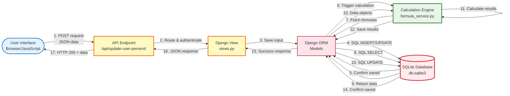
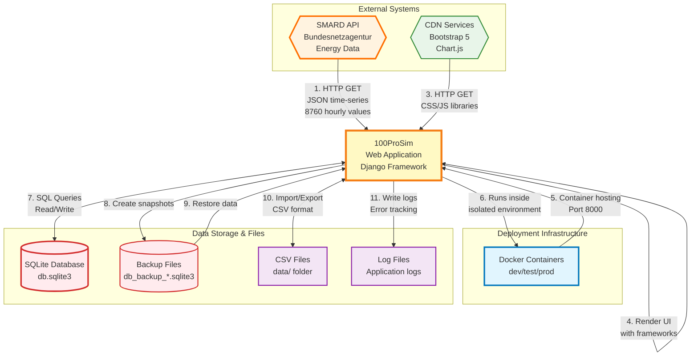
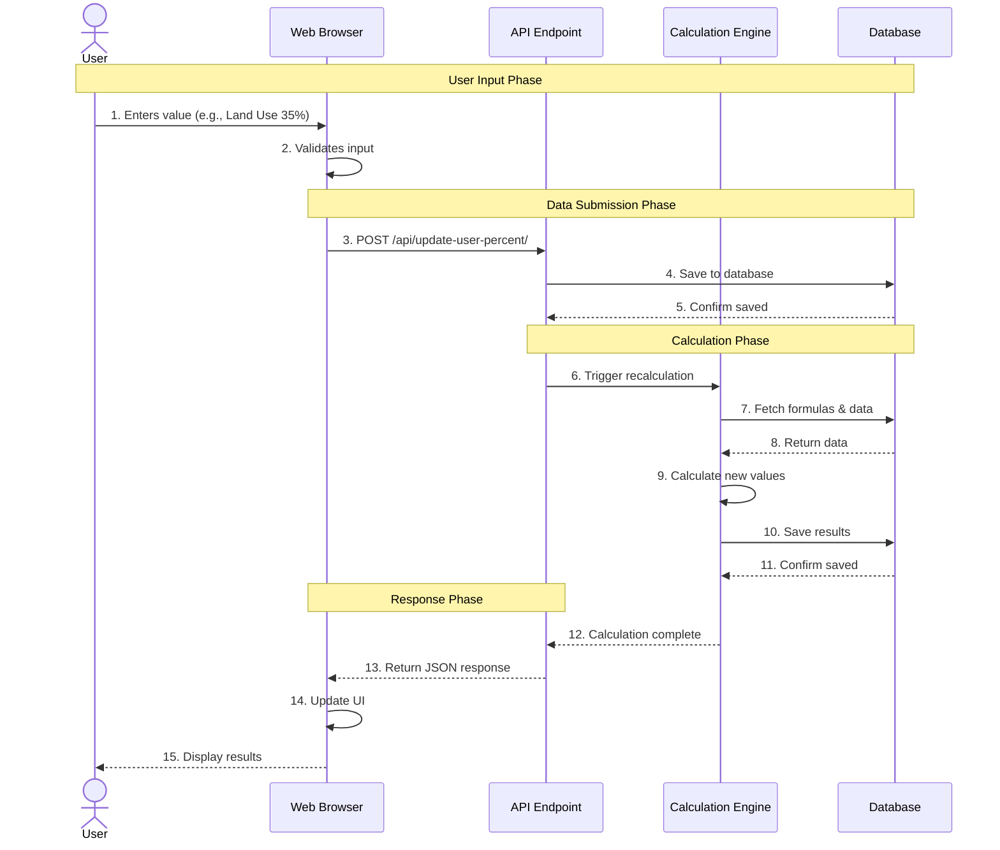
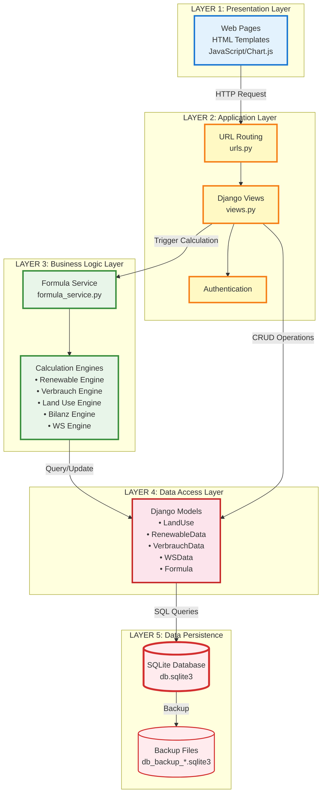
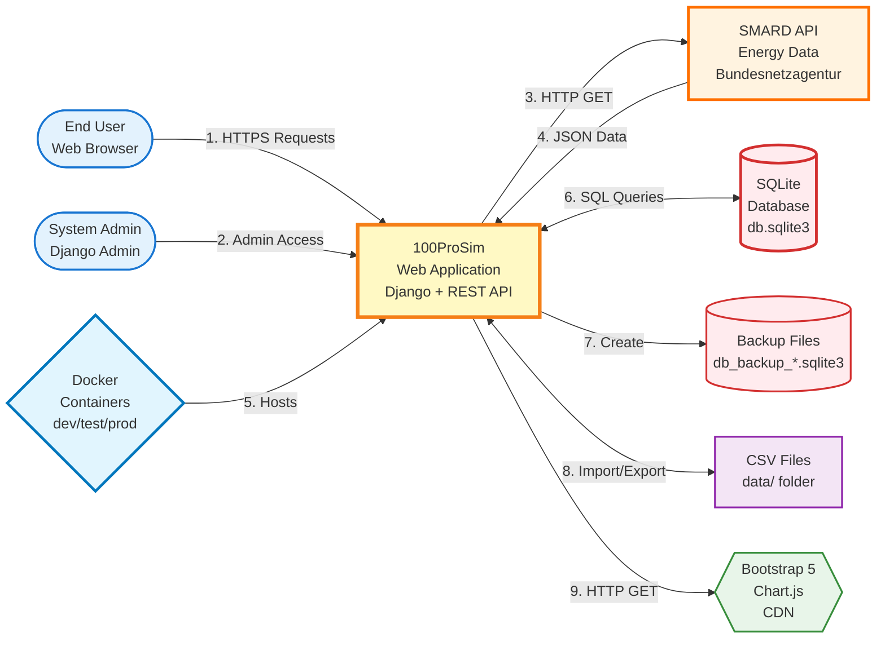

# 3.7 System Interfaces

This section describes the three primary interface types within the 100ProSim renewable energy simulation system: User Interface (UI), Internal System Interfaces, and External Interfaces.

---

## 3.7.1 User Interface

The 100ProSim system provides a web-based user interface built with Django templates, Bootstrap 5, and Chart.js for data visualization. The interface follows a responsive design pattern that adapts to different screen sizes and devices.

### Interface Architecture

The user interface is organized into a hierarchical navigation structure with the following main components:

1. **Landing Page**: Entry point providing system overview and navigation to main features
2. **Authentication System**: Login/registration pages for user access control
3. **Dashboard (Cockpit)**: Visual overview of key energy metrics with interactive charts
4. **Data Management Pages**: Specialized interfaces for different data categories
5. **Calculation and Analysis Views**: Interactive tools for energy balancing and simulation

### Core Interface Pages

**Land Use Management Interface**
- Displays land allocation data in tabular format with hierarchical code structure (e.g., LU_1.1, LU_2.1)
- Provides editable input fields for percentage values with real-time validation
- Implements automatic recalculation triggers when user modifies input values
- Shows both current status (ha) and target values (ha) side by side

**Renewable Energy Interface**
- Hierarchical tree view of renewable energy sources (Solar, Wind, Hydro, Biomass, etc.)
- Collapsible sections for improved navigation (main category 10 with subcategories 10.1-10.7)
- Inline editing capabilities for user-controlled values
- Color-coded indicators: blue for main categories, standard styling for subcategories
- Displays calculated values and formulas in read-only fields

**Energy Consumption (Verbrauch) Interface**
- Sectoral breakdown of energy consumption (Industrial, Transportation, Residential, etc.)
- Dual-value display showing current status vs. target (Ziel) values
- Percentage-based input system with automatic MWh conversion
- Formula transparency: hovering over calculated fields reveals underlying formulas

**Bilanz (Energy Balance) Interface**
- Split-panel layout comparing supply (Aktiva) and demand (Passiva)
- Visual indicators for energy surplus/deficit
- Interactive balancing algorithms accessible via action buttons
- Real-time calculation updates after user modifications

**Cockpit Dashboard**
- Card-based layout displaying key performance indicators (KPIs)
- Interactive Chart.js visualizations for renewable energy distribution
- Toggle buttons for switching between Status and Ziel (Target) views
- Responsive design adapting chart sizes to viewport dimensions

### User Input Mechanisms

The system implements multiple input methods optimized for different data types:

- **Direct Field Editing**: Text/number inputs with inline validation for percentage and numeric values
- **Slider Controls**: Used in specific contexts for intuitive percentage adjustments
- **Batch Operations**: "Save All" functionality to commit multiple changes simultaneously
- **Calculation Triggers**: Dedicated buttons for recalculation operations (Unified Recalc, Full Recalc)

### Data Visualization Components

Visualization is achieved through Chart.js 3.x library integration:

- **Pie Charts**: Renewable energy distribution by source type
- **Bar Charts**: Status vs. Target comparisons across categories
- **Line Graphs**: Temporal energy generation data (SMARD historical data integration)
- **Balance Sheets**: Visual comparison of supply and demand sides

### Session Persistence

The interface implements browser localStorage for maintaining user session state:

- Preserves scroll position across page reloads
- Maintains form input values during navigation
- Stores user preferences (collapsed/expanded sections)
- Implements baseline snapshot system for data restoration

**Recommendation for Thesis**: Include 2-3 screenshots showing:
1. Main dashboard (Cockpit) with charts
2. Land Use interface showing editable table
3. Bilanz balance sheet comparison view

---

## 3.7.2 Internal System Interfaces

The internal system architecture follows a modular design with clear separation between presentation, business logic, and data persistence layers.

### Layer Architecture

**Presentation Layer → Business Logic Layer → Data Access Layer → Database**

### API Interface Structure

The system exposes RESTful API endpoints for communication between frontend and backend:

**Data Update Endpoints**
```
POST /api/update-user-percent/          # Update single land use value
POST /api/save-all-inputs/              # Batch save multiple inputs
POST /api/update-verbrauch-bulk/        # Bulk update consumption data
POST /api/save-verbrauch-user-input/    # Single consumption value update
```

**Calculation Endpoints**
```
POST /api/run-full-recalc/              # Trigger complete system recalculation
POST /api/recalc-verbrauch/             # Recalculate consumption values
POST /api/recalc-ws-formulas/           # Recalculate energy storage formulas
POST /api/unified-recalc/               # Unified recalculation across all modules
```

**Balancing Algorithm Endpoints**
```
POST /api/balance-energy/               # Balance renewable energy supply
POST /api/balance-energy-lu6/           # Balance with land use constraint
POST /api/ws/balance/                   # Balance energy storage (WS)
POST /api/balance-full/                 # Full system balance
POST /api/balance-all/                  # Comprehensive balance operation
```

**Baseline Management Endpoints**
```
POST /api/baseline/create/              # Create database snapshot
POST /api/baseline/restore/             # Restore from snapshot
GET  /api/baseline/info/                # Retrieve baseline metadata
```

### Inter-Module Communication

The system implements a service-oriented architecture with specialized calculation engines:

**Formula Service (`formula_service.py`)**
- Central formula management and evaluation engine
- Database-first approach with fallback mechanisms
- Caching layer for performance optimization
- Variables resolved from FormulaVariable mappings

**Calculation Engines**
- `renewable_engine.py`: Renewable energy calculations with hierarchical aggregation
- `verbrauch_engine.py`: Consumption calculations with sectoral breakdown
- `landuse_engine.py`: Land use percentage and hectare conversions
- `bilanz_engine.py`: Energy balance sheet calculations
- `ws_engine.py`: Energy storage (Wärmespeicher) calculations with 365-day simulation

**Recalculation Service (`recalc_service.py`)**
- Orchestrates multi-module recalculation workflows
- Implements dependency resolution to prevent circular references
- Manages calculation order based on formula dependencies

### Data Model Interfaces

The Django ORM provides abstraction for database operations:

**Core Models**
- `LandUse`: Land allocation data with percentage and hectare fields
- `RenewableData`: Hierarchical renewable energy structure with parent-child relationships
- `VerbrauchData`: Energy consumption with status and target (Ziel) fields
- `WSData`: Energy storage with 365 daily rows plus summary rows (366, 367, 368)
- `Formula`: Database-stored formula expressions with category and type
- `FormulaVariable`: Variable-to-data-source mappings for formula evaluation

**Key Model Methods**
- `get_calculated_values()`: Retrieves computed values based on formulas
- `calculate_value()`: Executes formula evaluation for specific records
- `save()`: Override with validation and cascade update logic
- `refresh_from_db()`: Ensures latest values after concurrent modifications

### Signal System

Django signals coordinate cross-module updates:

- `post_save` signals trigger dependent recalculations when data changes
- `compute_ws_diagram_reference`: Recalculates WS reference after balance operations
- `recalculate_ws_data`: Triggers full WS table recomputation

### Transaction Management

Database transactions ensure data consistency:

- Atomic operations for batch updates using `@transaction.atomic` decorator
- Rollback mechanisms for failed calculations
- Optimistic locking to handle concurrent user modifications

### Internal Data Flow Diagram

**Shape Legend:**
- 📱 Rounded rectangle = Frontend Interface
- 🔌 Rectangle = API Endpoint
- ⚙️ Hexagon = Calculation Engine
- 🗄️ Cylinder = Database
- ➡️ Arrows = Data flow direction with operation labels

The following diagram illustrates the internal system flow from user input to database response:



**Figure X.X**: Internal system data flow showing the 17-step process from user input to database response. The diagram demonstrates the interaction between frontend (blue), application layer (yellow), calculation engine (green), data models (pink), and database (red). Each numbered step represents a discrete operation in the request-response cycle.

**Recommendation for Thesis**: Use the above diagram to illustrate internal system interfaces. Alternatively, refer to Diagram 1 (Sequence Diagram) in the Mermaid Diagrams section for a more detailed temporal view, or Diagram 2 (Component Diagram) for the complete layered architecture overview.

---

## 3.7.3 External Interfaces

The system integrates with external data sources and provides extensibility points for future integrations.

### External Data Sources

**SMARD API Integration**
- **Purpose**: Historical energy generation data from German energy market
- **Data Source**: SMARD (Strommarktdaten) platform by Bundesnetzagentur
- **Data Format**: JSON time-series data
- **Access Method**: HTTP GET requests to public API endpoints
- **Data Types**: Solar generation, Wind generation, Hydro generation, Total demand
- **Temporal Coverage**: Complete year 2023 data (8760 hourly values)
- **Implementation**: `cookies.txt` for session management, HTTP client library for requests

**Integration Workflow**:
1. System sends HTTP request to SMARD API with date range and data category
2. Receives JSON response with timestamp-value pairs
3. Parses and stores data locally for visualization
4. Renders time-series charts using Chart.js

### Database Interface

**SQLite Database System**
- **Engine**: SQLite 3 (file-based relational database)
- **Connection**: Django ORM abstraction layer
- **File Location**: `db.sqlite3` in project root
- **Backup System**: Automatic snapshots (`db_backup_*.sqlite3`)
- **Configuration**: Timeout set to 60 seconds to handle concurrent writes

**Database Schema**:
- 10+ tables including simulator_landuse, simulator_renewabledata, simulator_verbrauchdata, simulator_wsdata
- Foreign key relationships for hierarchical data structures
- Index optimization on frequently queried fields (code, category)

### Docker Containerization Interface

**Container Orchestration**: Docker Compose configuration defines service interfaces

```
Services:
- app-dev: Development environment (DEBUG=true, port 8000)
- app-test: Testing environment (automated test runner)
- app-prod: Production environment (DEBUG=false, restart policy)
```

**Volume Mounts**: Bind mount `.:/app` for live code updates during development

**Network Interfaces**: Exposed port 8000 for HTTP access (Django development server)

### File System Interface

**CSV Data Import/Export**
- **Import Directory**: `data/` folder containing baseline CSV files
- **Supported Operations**: Initial data seeding, backup export, baseline restoration
- **File Formats**: UTF-8 encoded CSV with headers

**Python Script Interfaces**
- Management commands executed via `manage.py` for administrative tasks
- Standalone scripts (e.g., `convert_ws_to_formula_variables.py`) for data migrations
- Test suites using Django test framework

### Authentication Interface

**Django Authentication System**
- **Login Interface**: POST to `/login/` with username/password
- **Session Management**: Django session middleware with cookie-based sessions
- **Authorization**: `@login_required` decorators enforce access control
- **Password Hashing**: Django's PBKDF2 algorithm for secure password storage

### Future Extensibility Points

The system architecture provides interfaces for potential future integrations:

1. **Weather API Integration**: For real-time solar/wind generation forecasting
2. **Database Migration Path**: SQLite → PostgreSQL for production scalability
3. **REST API Extension**: Full CRUD API for third-party system integration
4. **Excel Import/Export**: Bidirectional data exchange with spreadsheet tools
5. **PyPSA Integration**: Power System Analysis library for advanced grid modeling (prepared but not implemented)

### Error Handling and Logging

**Interface Layer Error Management**:
- HTTP status codes (200 OK, 400 Bad Request, 500 Internal Server Error)
- JSON error responses with structured messages
- Django logging framework with configurable levels (INFO, WARNING, ERROR)
- Client-side error display using Bootstrap alert components

### External System Integration Diagram

**Shape Legend:**
- 🌐 Cloud = External API Service
- 🐳 Hexagon = Deployment Infrastructure
- 🟨 Yellow rectangle (thick border) = Main System
- 🗄️ Cylinder = Database Storage
- 📄 Rectangle = File System
- ☁️ Cloud shape = External Libraries (CDN)
- ➡️ Solid arrows = Data flow
- ⬌ Bidirectional arrows = Two-way interaction

The following diagram illustrates the external interfaces and integration points:



**Figure X.X**: External system integration diagram showing the 11 key external interfaces. The diagram illustrates interactions with external APIs (SMARD for energy data, CDN for libraries), deployment infrastructure (Docker), and data storage/file systems (SQLite database, backup files, CSV imports, logs). Color coding: Orange = External API, Green = CDN Libraries, Blue = Infrastructure, Yellow = Main System, Red = Databases, Purple = File System.

**Recommendation for Thesis**: Use the above diagram to illustrate external system interfaces. Alternatively, refer to Diagram 3 (Context Diagram) in the Mermaid Diagrams section for a comprehensive view of all external connections and system boundaries.

---

## Summary

The 100ProSim system implements a three-tier interface architecture:

1. **User Interface**: Web-based responsive UI with Chart.js visualizations and real-time data editing
2. **Internal Interfaces**: RESTful API layer, service-oriented calculation engines, and Django ORM abstraction
3. **External Interfaces**: SMARD API integration, SQLite database, Docker containerization, and file system access

This modular design ensures separation of concerns, maintainability, and extensibility for future enhancements.

---

## Thesis Presentation Recommendations

### Suggested Visual Aids

**For Section 3.7.1 (User Interface)**:
- **2-3 Screenshots**: Cockpit dashboard, Land Use editable table, Bilanz balance view
- **Optional**: Workflow diagram showing user input → validation → save → recalculation

**For Section 3.7.2 (Internal System Interfaces)**:
- **Sequence Diagram**: User action → API → Calculation Engine → Database → Response (see Diagram 1 below)
- **Alternative**: Component/Layer diagram showing Presentation → Business Logic → Data Access → Database (see Diagram 2 below)
- **Optional**: Code snippet showing typical API endpoint structure (5-10 lines)

**For Section 3.7.3 (External Interfaces)**:
- **Context Diagram**: System with external connections to Browser, Database, and File System (see Diagram 3 below)
- **Alternative**: Table with columns: Interface | Protocol | Data Format | Purpose

---

## Mermaid Diagrams for Thesis

### Diagram 1: Sequence Diagram - User Input Flow

**Shape Legend:**
- 🧑 Actor (stick figure) = User
- 📦 Box = System Component/Process
- ➡️ Solid arrow = Request/Action
- ⬅️ Dashed arrow = Response/Return

This diagram illustrates the complete flow from user interaction to database update and response.



**Figure X.X**: Sequence diagram showing the complete data flow from user input to database persistence and UI update. Numbers indicate the sequential order of operations across four main phases: Input, Submission, Calculation, and Response.

---

### Diagram 2: Component Diagram - System Architecture Layers

**Shape Legend:**
- 🔵 Blue Rectangle = Presentation Layer (User Interface)
- 🟡 Yellow Rectangle = Application Layer (Request Handling)
- 🟢 Green Rectangle = Business Logic Layer (Calculations)
- 🔴 Red Rectangle = Data Model (Database Tables)
- 🗄️ Cylinder = Physical Storage (Files/Database)

This diagram shows the modular component architecture and inter-layer communication.



**Figure X.X**: Component diagram illustrating the five-layer architecture of the 100ProSim system. Data flows downward from user interface through application logic, business calculations, data models, and finally to persistent storage. Each layer is color-coded: Blue (UI), Yellow (Application), Green (Business Logic), Pink (Data Models), Red (Storage).

---

### Diagram 3: Context Diagram - System Boundaries and External Interfaces

**Shape Legend:**
- 👤 Rectangle with rounded corners = External User/Actor
- 🟨 Yellow rectangle (thick border) = Main System (100ProSim)
- 🟧 Orange rectangle = External API
- 🟦 Blue rectangle = Deployment Infrastructure
- 🗄️ Cylinder = Database/File Storage
- 📄 Rectangle = Files/Documents
- ☁️ Cloud shape = External Libraries/Services
- ➡️ Solid arrow = Data flow
- ⋯➡️ Dashed arrow = Dependency/Uses

This diagram shows the system's interaction with external entities, APIs, deployment infrastructure, and data sources.



**Figure X.X**: Context diagram showing the 100ProSim system boundaries and its interactions with external entities. The diagram illustrates nine key interactions: (1-2) User access, (3-4) SMARD API data exchange, (5) Docker hosting, (6) Database operations, (7) Backup creation, (8) CSV import/export, and (9) CDN library access. Color coding: Blue = Users, Orange = External API, Yellow = Main System, Light Blue = Infrastructure, Red = Databases, Purple = Files, Green = Libraries.

---

### How to Use These Diagrams in Your Thesis

**Option 1: Render as Images**
1. Use an online Mermaid editor (e.g., https://mermaid.live/)
2. Copy each code block and render as PNG/SVG
3. Insert images into your thesis document
4. Add figure captions below each diagram

**Option 2: Use Mermaid-Enabled Tools**
- If your thesis is written in Markdown: Keep code blocks as-is (many renderers support Mermaid)
- If using LaTeX: Convert to images first or use mermaid LaTeX package
- If using Word: Render to PNG and insert as figures

**Recommended Figure Placement**:
- **Diagram 1 (Sequence)**: Place in Section 3.7.2 (Internal System Interfaces)
- **Diagram 2 (Component)**: Place in Section 3.7.2 or at the beginning of Section 3.7
- **Diagram 3 (Context)**: Place in Section 3.7.3 (External Interfaces) or as overview in 3.7 introduction

### Content Balance Assessment

The documentation provides:
- ✅ **Appropriate Detail Level**: Technical enough for thesis committee, not overwhelming
- ✅ **Clear Structure**: Logical progression from UI → Internal → External
- ✅ **Concrete Examples**: Specific endpoints, file names, technologies mentioned
- ✅ **Academic Tone**: Professional terminology suitable for thesis submission

### Suggested Additions to Thesis Document

When pasting into thesis, consider adding:
1. **Introduction Paragraph**: Brief overview of why these interfaces are important
2. **Reference Citations**: Mention Django documentation, Chart.js library, SMARD source
3. **Comparison Table**: This system's interfaces vs. typical enterprise systems (if relevant)
4. **Security Note**: Brief mention of CSRF protection, authentication requirements

**Length Estimate**: As written, approximately 1,800 words (suitable for thesis subsection)
